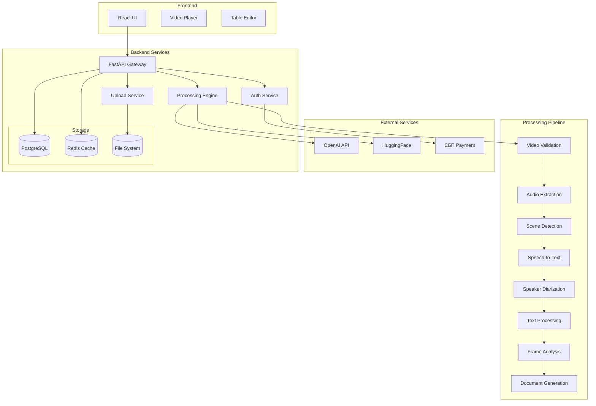

# Design Document

## Overview

Сервис "filmlist" представляет собой веб-приложение для автоматического создания монтажных листов из видеофайлов. Система построена на основе FastAPI backend с асинхронной обработкой задач и React frontend для интерактивного пользовательского интерфейса.

Архитектура следует принципам микросервисов с четким разделением ответственности между компонентами обработки видео, управления пользователями, и генерации документов.

## Architecture

### High-Level Architecture



### System Components

1. **API Gateway (FastAPI)** - центральная точка входа, маршрутизация запросов
2. **Processing Engine** - асинхронная обработка видео через пайплайн
3. **Authentication Service** - управление пользователями и биллинг
4. **File Management** - загрузка, хранение и доступ к файлам
5. **Document Generator** - создание DOCX файлов по шаблону

## Components and Interfaces

### Core Services

#### 1. API Gateway (`app/main.py`)
```python
class FilmlistAPI:
    def __init__(self):
        self.app = FastAPI()
        self.setup_routes()
        self.setup_middleware()
    
    # Endpoints
    async def upload_video(file: UploadFile) -> TaskResponse
    async def get_status(task_id: str) -> StatusResponse
    async def update_montage(task_id: str, rows: List[MontageRow]) -> UpdateResponse
    async def upload_srt(task_id: str, file: UploadFile) -> UpdateResponse
    async def download_docx(task_id: str) -> FileResponse
    async def save_project(task_id: str, rows: List[MontageRow]) -> SaveResponse
```

#### 2. Processing Engine (`app/services/processor.py`)
```python
class VideoProcessor:
    def __init__(self):
        self.pipeline = ProcessingPipeline()
    
    async def process_video(task_id: str, video_path: str, use_srt: bool = False) -> ProcessingResult
    async def process_with_srt(task_id: str, video_path: str, srt_path: str) -> ProcessingResult
    
class ProcessingPipeline:
    async def validate_video(video_path: str) -> ValidationResult
    async def extract_audio(video_path: str) -> str  # audio_path
    async def detect_scenes(video_path: str, min_scene_length: float = 2.0) -> List[Scene]
    async def transcribe_audio(audio_path: str, language: str = "ru") -> TranscriptionResult
    async def diarize_speakers(audio_path: str) -> DiarizationResult
    async def process_text(text: str) -> str
    async def extract_keyframes(video_path: str, scenes: List[Scene]) -> List[Keyframe]
    async def analyze_frames(keyframes: List[Keyframe], dialogue: str) -> AnalysisResult
    async def generate_montage_table(scenes: List[Scene], analysis: AnalysisResult) -> List[MontageRow]
```

#### 3. Authentication & Billing (`app/services/auth.py`)
```python
class AuthService:
    async def authenticate_user(token: str) -> User
    async def get_user_balance(user_id: str) -> Balance
    async def charge_processing(user_id: str, duration_minutes: float) -> ChargeResult
    async def process_payment(user_id: str, amount: float) -> PaymentResult

class BillingService:
    RATE_PER_MINUTE = 75.0  # рублей за минуту
    
    async def calculate_cost(video_duration: float) -> float
    async def has_sufficient_balance(user_id: str, cost: float) -> bool
```

#### 4. Document Generator (`app/services/docgen.py`)
```python
class DocumentGenerator:
    def __init__(self):
        self.template_path = "templates/montage_template.docx"
    
    async def generate_docx(montage_data: MontageData, metadata: FilmMetadata) -> bytes
    async def format_timecode(seconds: float, fps: float) -> str
    async def apply_goskino_formatting(rows: List[MontageRow]) -> List[MontageRow]
```

### Data Models

#### Core Models (`app/models/`)

```python
@dataclass
class Scene:
    start_time: float
    end_time: float
    duration: float
    keyframes: List[str]  # paths to keyframe images

@dataclass
class MontageRow:
    number: int
    start_timecode: str
    end_timecode: str
    shot_type: ShotType  # Дальний, Общий, Средний, Крупный, Деталь
    description: str
    dialogue: str
    speaker: Optional[str] = None
    has_music: bool = False

@dataclass
class ProcessingTask:
    task_id: str
    user_id: str
    status: TaskStatus
    video_path: str
    srt_path: Optional[str]
    progress: float
    current_step: str
    result: Optional[List[MontageRow]]
    error: Optional[str]
    created_at: datetime
    updated_at: datetime

@dataclass
class FilmMetadata:
    title: str
    production_company: str
    year: int
    country: str
    screenwriters: List[str]
    copyright_holders: List[str]
    duration: str
    episodes_count: int
    format: str
    color_type: str  # "Цветной" | "Черно-белый"
    media_carrier: str
    original_language: str
    subtitle_language: str
    audio_language: str

@dataclass
class ProjectSettings:
    timecode_start: str  # "01:00:00:00" or "00:00:00:00"
    standard: str        # "ГФФ" or "Красногорский"
    fps: float          # Frame rate for timecode calculations

enum ShotType:
    DISTANT = "Дальний"
    GENERAL = "Общий"
    MEDIUM = "Средний"
    CLOSE = "Крупный"
    DETAIL = "Деталь"

enum TaskStatus:
    PENDING = "pending"
    PROCESSING = "processing"
    COMPLETED = "completed"
    FAILED = "failed"
```

## Data Models

### Database Schema (PostgreSQL)

```sql
-- Users and Authentication
CREATE TABLE users (
    id UUID PRIMARY KEY DEFAULT gen_random_uuid(),
    email VARCHAR(255) UNIQUE NOT NULL,
    password_hash VARCHAR(255) NOT NULL,
    balance DECIMAL(10,2) DEFAULT 0.00,
    created_at TIMESTAMP DEFAULT NOW(),
    updated_at TIMESTAMP DEFAULT NOW()
);

-- Processing Tasks
CREATE TABLE processing_tasks (
    id UUID PRIMARY KEY DEFAULT gen_random_uuid(),
    user_id UUID REFERENCES users(id),
    status VARCHAR(50) NOT NULL,
    video_filename VARCHAR(255) NOT NULL,
    video_path VARCHAR(500) NOT NULL,
    srt_path VARCHAR(500),
    progress FLOAT DEFAULT 0.0,
    current_step VARCHAR(100),
    error_message TEXT,
    result JSONB,
    created_at TIMESTAMP DEFAULT NOW(),
    updated_at TIMESTAMP DEFAULT NOW()
);

-- Film Projects
CREATE TABLE film_projects (
    id UUID PRIMARY KEY DEFAULT gen_random_uuid(),
    user_id UUID REFERENCES users(id),
    task_id UUID REFERENCES processing_tasks(id),
    title VARCHAR(255) NOT NULL,
    metadata JSONB NOT NULL,
    montage_rows JSONB,
    created_at TIMESTAMP DEFAULT NOW(),
    updated_at TIMESTAMP DEFAULT NOW()
);

-- Payment Transactions
CREATE TABLE transactions (
    id UUID PRIMARY KEY DEFAULT gen_random_uuid(),
    user_id UUID REFERENCES users(id),
    amount DECIMAL(10,2) NOT NULL,
    type VARCHAR(50) NOT NULL, -- 'charge' | 'payment'
    description TEXT,
    created_at TIMESTAMP DEFAULT NOW()
);
```

### Redis Cache Structure

```python
# Task progress tracking
task:{task_id}:progress = {
    "status": "processing",
    "step": "scene_detection",
    "progress": 0.35,
    "eta_seconds": 120
}

# User session cache
user:{user_id}:session = {
    "balance": 1500.00,
    "active_tasks": ["task_1", "task_2"]
}

# Rate limiting
rate_limit:openai:{user_id} = request_count
rate_limit:processing:{user_id} = concurrent_tasks_count
```

## Error Handling

### Error Categories and Responses

1. **Validation Errors** (400)
   - Неподдерживаемый формат видео
   - Превышение размера файла
   - Недостаточный баланс

2. **Processing Errors** (500)
   - Ошибки FFmpeg
   - Недоступность OpenAI API
   - Ошибки транскрипции

3. **Rate Limiting** (429)
   - Превышение лимитов OpenAI
   - Слишком много одновременных задач

### Retry Strategy

```python
class RetryHandler:
    async def with_exponential_backoff(
        self, 
        func: Callable, 
        max_retries: int = 3,
        base_delay: float = 1.0
    ) -> Any:
        for attempt in range(max_retries):
            try:
                return await func()
            except RateLimitError as e:
                if attempt == max_retries - 1:
                    raise
                
                # Parse "try again in X seconds" from error message
                delay = self.parse_retry_delay(str(e)) or (base_delay * (2 ** attempt))
                await asyncio.sleep(delay)
            except Exception as e:
                if attempt == max_retries - 1:
                    raise
                await asyncio.sleep(base_delay * (2 ** attempt))

    def parse_retry_delay(self, error_message: str) -> Optional[float]:
        # Extract delay from OpenAI error messages
        import re
        match = re.search(r'try again in (\d+(?:\.\d+)?) seconds?', error_message)
        return float(match.group(1)) if match else None
```

### Fallback Mechanisms

```python
class FallbackService:
    async def get_transcription(self, audio_path: str) -> str:
        try:
            return await self.openai_transcribe(audio_path)
        except OpenAIUnavailableError:
            logger.warning("OpenAI unavailable, using fallback transcription")
            return await self.fallback_transcribe(audio_path)
    
    async def fallback_transcribe(self, audio_path: str) -> str:
        # Return test transcription or use local Whisper model
        return "Тестовая транскрипция для демонстрации работы системы."
```

### Visual Analysis Prompt System

```python
class VisualAnalysisService:
    SCENE_ANALYSIS_PROMPT = """
Ты — профессиональный ассистент режиссера монтажа. Твоя задача — проанализировать ДВА кадра из одной сцены (35% и 70% от длительности) и создать единое описание сцены в формате JSON длиною в одно предложение без эмоционального окраса. Если ты считаешь, что это архивное изображение или фотография, то отметь это.

**Определения планов:**
- **Дальний:** Человек занимает очень маленькое место
- **Общий:** Человек в полный рост  
- **Средний:** Человек по колени или по пояс
- **Крупный:** Голова человека занимает почти весь кадр
- **Деталь:** Часть лица или небольшой предмет

**Специальные теги:**
- **ЗТМ:** Затемнение
- **НДП:** Надписи (если есть читаемый текст)

**Инструкция:**
1. Проанализируй оба кадра как единую сцену
2. Определи основной тип плана
3. Опиши действие максимально кратко в одно предложение без эмоционального окраса
4. Если персонаж говорит но не виден в кадре - добавь тег "ГЗК"

**Формат ответа (строго JSON):**
```json
{
    "shot_type": "Ср.",
    "description": "Краткое описание действия в одно предложение",
    "text_in_frame": "Читаемый текст если есть"
}
```
"""

    async def analyze_scene_frames(self, frame1_path: str, frame2_path: str, dialogue: str) -> dict:
        # Implementation for GPT-5-mini visual analysis
        pass
```

### Timecode Management System

```python
class TimecodeService:
    def __init__(self, start_time: str = "00:00:00:00", standard: str = "ГФФ"):
        self.start_time = start_time  # "01:00:00:00" or "00:00:00:00"
        self.standard = standard      # "ГФФ" or "Красногорский"
    
    def format_timecode(self, seconds: float, fps: float) -> str:
        # Convert seconds to HH:MM:SS:FF format
        pass
    
    def ensure_continuity(self, scenes: List[Scene], fps: float) -> List[Scene]:
        # Ensure exactly one frame gap between scenes
        for i in range(1, len(scenes)):
            prev_end_frame = self.seconds_to_frames(scenes[i-1].end_time, fps)
            scenes[i].start_time = self.frames_to_seconds(prev_end_frame + 1, fps)
        return scenes
    
    def seconds_to_frames(self, seconds: float, fps: float) -> int:
        return int(seconds * fps)
    
    def frames_to_seconds(self, frames: int, fps: float) -> float:
        return frames / fps
```

## Testing Strategy

### Unit Tests
- Тестирование каждого компонента пайплайна изолированно
- Мокирование внешних API (OpenAI, HuggingFace)
- Валидация форматирования данных

### Integration Tests
- Полный пайплайн обработки с тестовыми файлами
- API endpoints с различными сценариями
- Обработка ошибок и fallback механизмы

### Test Cases

```python
class TestProcessingPipeline:
    async def test_short_video_with_srt(self):
        # Тест с коротким видео и SRT файлом
        pass
    
    async def test_long_video_auto_transcription(self):
        # Тест с длинным видео и автотранскрипцией
        pass
    
    async def test_video_with_music_detection(self):
        # Тест определения музыки в сценах
        pass
    
    async def test_openai_unavailable_fallback(self):
        # Тест fallback при недоступности OpenAI
        pass
    
    async def test_scene_detection_short_scenes(self):
        # Тест фильтрации коротких сцен
        pass

class TestDocumentGeneration:
    async def test_goskino_format_compliance(self):
        # Проверка соответствия формату Госфильмфонда
        pass
    
    async def test_timecode_conversion(self):
        # Тест конвертации секунд в таймкод
        pass
```

### Performance Testing
- Нагрузочное тестирование с множественными загрузками
- Тестирование обработки больших файлов (>1GB)
- Мониторинг использования памяти и CPU

## Deployment Architecture

### Production Environment

```yaml
# docker-compose.yml
version: '3.8'
services:
  api:
    build: .
    environment:
      - DATABASE_URL=postgresql://user:pass@db:5432/filmlist
      - REDIS_URL=redis://redis:6379
      - OPENAI_API_KEY=${OPENAI_API_KEY}
      - HF_TOKEN=${HF_TOKEN}
    volumes:
      - ./uploads:/app/uploads
      - ./output:/app/output
    depends_on:
      - db
      - redis
  
  db:
    image: postgres:15
    environment:
      POSTGRES_DB: filmlist
      POSTGRES_USER: user
      POSTGRES_PASSWORD: pass
    volumes:
      - postgres_data:/var/lib/postgresql/data
  
  redis:
    image: redis:7-alpine
    
  nginx:
    image: nginx:alpine
    ports:
      - "80:80"
      - "443:443"
    volumes:
      - ./nginx.conf:/etc/nginx/nginx.conf
      - ./ssl:/etc/ssl
```

### Monitoring and Logging

```python
# Structured logging
import structlog

logger = structlog.get_logger()

class ProcessingLogger:
    def log_step_start(self, task_id: str, step: str):
        logger.info("Processing step started", 
                   task_id=task_id, 
                   step=step, 
                   timestamp=datetime.utcnow())
    
    def log_step_complete(self, task_id: str, step: str, duration: float):
        logger.info("Processing step completed", 
                   task_id=task_id, 
                   step=step, 
                   duration=duration)
    
    def log_error(self, task_id: str, step: str, error: Exception):
        logger.error("Processing error", 
                    task_id=task_id, 
                    step=step, 
                    error=str(error), 
                    traceback=traceback.format_exc())
```

## Security Considerations

### Authentication & Authorization
- JWT токены для аутентификации
- Rate limiting по пользователям
- Валидация загружаемых файлов

### File Security
- Сканирование загружаемых файлов на вирусы
- Ограничение типов и размеров файлов
- Изоляция пользовательских файлов

### API Security
- CORS настройки
- Request validation
- SQL injection protection через ORM

### Data Privacy
- Автоматическое удаление обработанных файлов через 30 дней
- Шифрование чувствительных данных в БД
- Логирование доступа к пользовательским данным